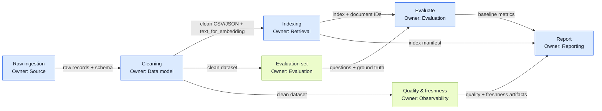

# Checkpoint 0 — Handoff: Raw → Clean → Index → Evaluate → Report

| Handoff | Bàn giao bắt buộc | Kiểm tra trước khi nhận |
| --- | --- | --- |
| Raw → Clean | `data/raw/crossref_response.json`, `data/raw/crossref_records.json`; contract [`cp0_clean_contract.md`](cp0_clean_contract.md) | `paper_id` được chuẩn hóa và ổn định; title, summary, published hợp lệ; raw count đối chiếu được với clean count và drop log |
| Clean → Index | `data/clean/papers_clean.csv`, `data/clean/papers_clean.json`, `data/quality/clean_drop_log.json` | Chạy `uv run python script/validate_clean.py` đạt pass: đúng `CLEAN_COLUMNS`, không NaN/trùng `paper_id`, `text_for_embedding` và `age_days` tái tạo được |
| Clean → Evaluate | Clean dataset và `data/eval/evaluation_set.json` | Mỗi câu hỏi có `question`, `ground_truth`, `ground_truth_doc_ids`, `question_type`; doc IDs tồn tại trong clean data |
| Index → Evaluate | Index/manifest trong `data/embeddings/`; document IDs đã index | Số bản ghi index khớp clean dataset; search thử trả về document hợp lệ |
| Evaluate + Quality → Report | `data/results/baseline_metrics.json`; artifact quality/freshness trong `data/quality/` | Metrics dùng đúng evaluation set; quality/freshness có timestamp và số liệu khớp artifact |
| Report | `data/reports/phase1_report.md` | Nêu rõ nguồn dữ liệu, số record, cấu hình index, metrics, quality/freshness và đường dẫn bằng chứng |

## Quy ước phối hợp

- `paper_id` là định danh xuyên suốt từ raw đến index và evaluation; được normalize từ DOI, bỏ prefix và chuyển lowercase.
- Chỉ chuyển bước khi artifact ở bước trước đã tồn tại, đọc được và vượt kiểm tra trong bảng trên.
- Nếu cleaning thay đổi schema, phải tạo lại index và evaluation set trước khi đánh giá.
- Report chỉ dùng metrics và artifact được sinh ra trong cùng lần chạy pipeline.
